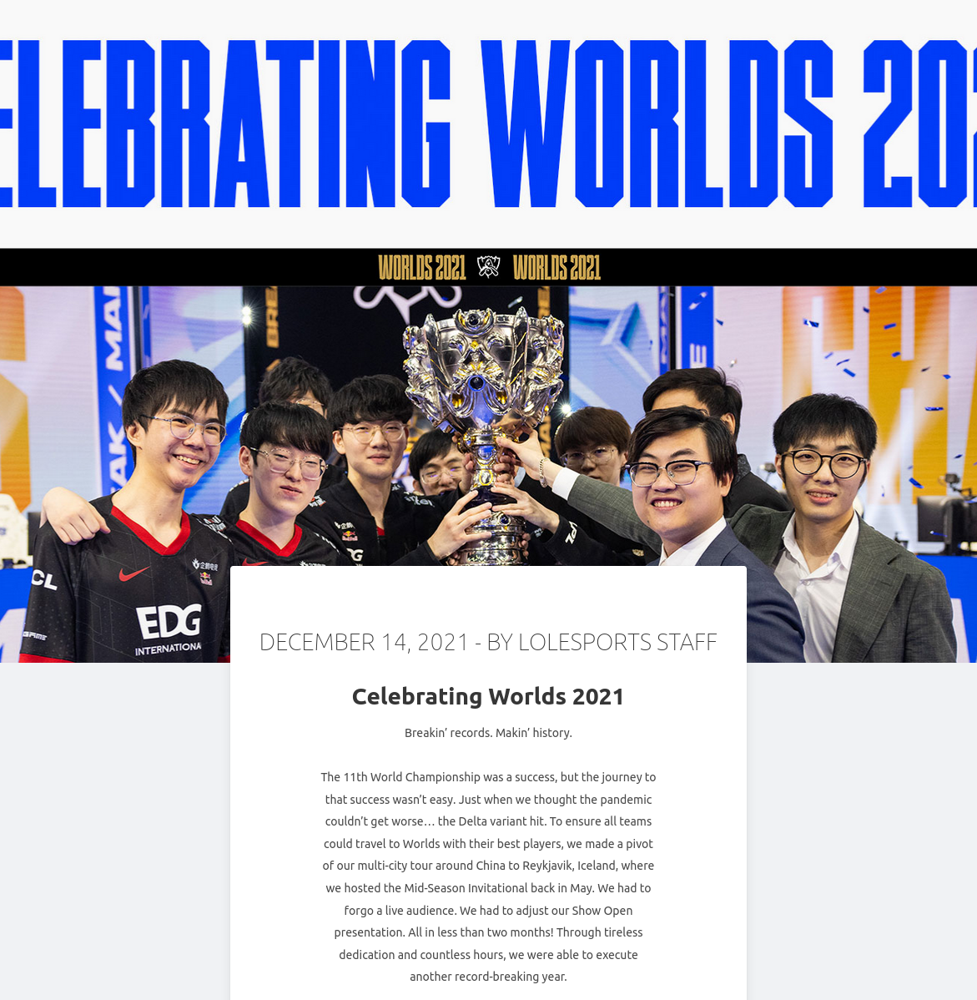

# User Storys
To check up on the recent worlds 2021 winers in league of elgends esports!

# So far what I have done


# Installation guide
- fork and clone this repo down
- CD into the folder 
- open the terminal and put ``` npm install ```
- then do ``` npm start ``` in the terminal

# Components

so far I only have the main page as the componet 


# A snippet

``` js
class App extends Component {
  render() {
    return (
      <div className="App">
        {/* <Showcase /> */}
        <Blog />
      </div>
    )
  }
}

``` 

# more components to come

# Tests

they are not impemented yet but future me shouuuuld have em in my tomorrow 12/21/2021 if not punch her

to run them do ``` npm test ```

# future test code snippet here

```js
test('renders Blog Posts Template subtitle', () => {
    render(<Blog />);
    const subtitleElement = screen.getByText(/DECEMBER 14, 2021 - BY LOLESPORTS STAFF/i);
    expect(subtitleElement).toBeInTheDocument();
});
```